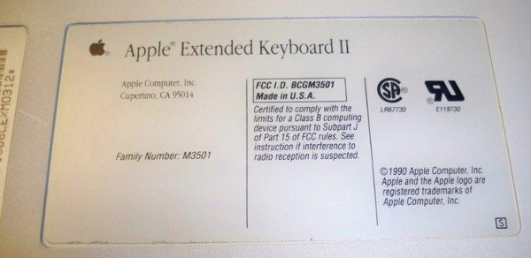
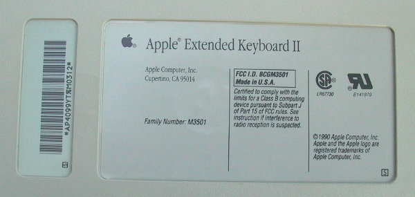
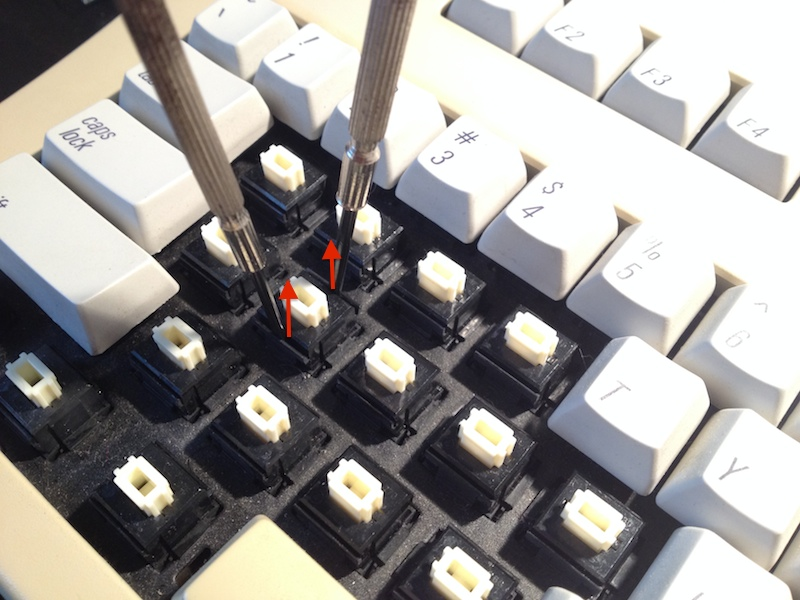
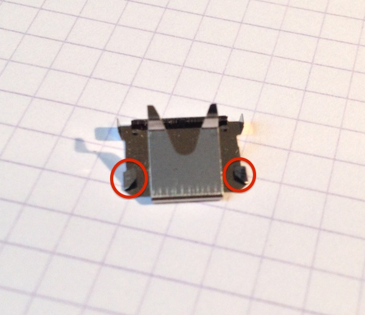
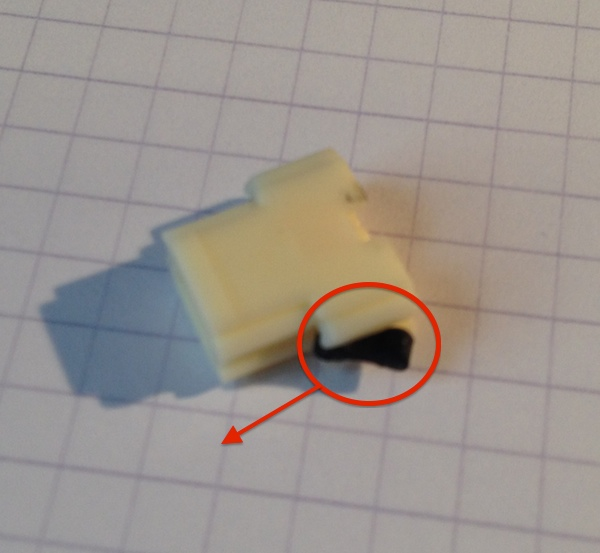
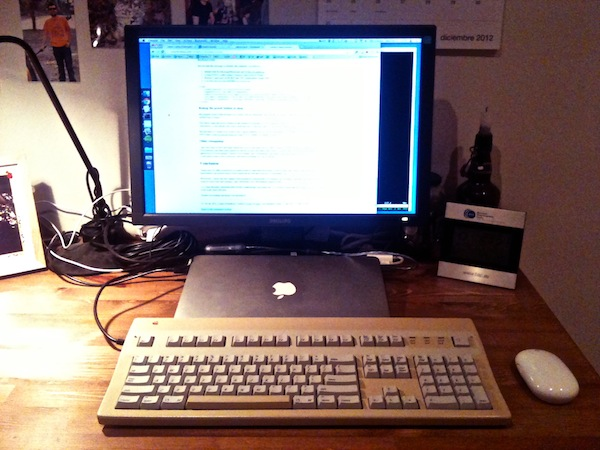

# Tuning an Apple Extended Keyboard II

As a person who spends at least eight hours, five days a week in
front of a computer, choosing the correct keyboard is not an easy
task. Your hands spend about eight hours a day touching and typing
on it. Probably, while you are thinking, your fingers fiddle with
the keys without pressing them. The office's background noise is
those of keys typing. We could say that at least two of your senses
highly notice your keyboard for a huge part of your life.

Most people work with cheap 20€ keyboards, but for those
interested,
[there is a huge gamma of keys](http://www.daskeyboard.com/blog/?page_id=1458)
and keyboards.

I have been following forums and pages about mechanical keyboards
for some time. However, it was Steve Losh's
[A Modern Space Cadet](http://stevelosh.com/blog/2012/10/a-modern-space-cadet/)
which finally convinced me that I needed a better keyboard. To
decide on one, however, is a path full of enlightenment, reading
about key switches, historical keyboards, highly biased commenters,
and the utmost fear of spending 400€ on an device you won't like
for some reason.

I was just about to buy a Topre 104 when I thought I should give
myself more time before paying that much. After all, what if I were
to buy one and decided it just didn't feel right?

## A 20-year-old keyboard, the Apple Extended II

After about a month of reading on forums,
[this article from Thomas Brand](http://eggfreckles.net/notes/apples-greatest-keyboard/)
and
[a podcast with John Gruber and Dan Benjamin](http://thetalkshow.net/#20)
brought this 20-year-old keyboard to my attention. It was highly
praised, seemed to be very robust, and had Apple's 'command' and
'alt' keys.

[](http://www.flickr.com/photos/gruber/2452372207/)

There are usually some for sale on Ebay, and I needed a really
cheap one, since the shipping to Spain would account for at least
50€. Furthermore, that keyboard also needs an ADB cable and the
Griffin Imate to convert ADB to USB. Plus their shipping, too. The
total could easily account for 100 Eur or maybe more, for a really
old device.

Apparently there's another factor to take into account. There are
at least two different models, a good one, with Alps switches, and
a not-so-good one, with Mitsumi switches. To make matters worse,
there is no clear way to distinguish them. However, looking at the
label can help. Here are the labels of Apple keyboards with Alps
switches.





You should look for the "Made in the USA" and the bar code ending
in M3012. My advice is to always ask the seller for confirmation,
it is a matter of removing one keycap and
[looking for the 'ALPS' label](http://imgur.com/a/elAFF#2) on the
top of the key switch.

## The vanilla AEKII

When the keyboard finally arrived, I tried to type on it, and
unfortunately I didn't like its sound at all. After a month reading
about clicky keyboards, watching Youtube videos and remembering an
IBM Model M I had at college for some time, the AEKII had muffled,
plain, *boring* keystrokes.

[Here's an audio](https://raw.github.com/carlesfe/aekii/master/img/click.mp3) recording what I mean for 'click' (first sound) and
'clock' (second sound)

It is also worth mentioning that the Caps Lock key is a two-step
button. That would have been amazing for a Caps Lock key, but since
I use Ctrl instead, that would defeat its purpose.

Now there are two options: stick with it, as is, or open the
keyboard and see that could be done. Since I had opened and
repaired my laptop, my old Gameboy, and almost every object that
had fallen into my hands, why not a keyboard? I might learn
something as a collateral.

## The mysterious keyboard tune

How on Earth does a keyboard make a clicky sound when a key is
pressed? Reddit user
[ripster55](http://www.reddit.com/user/ripster55) helped me a lot
with both his pictures and his comments

[This animation](http://i.imgur.com/upQWT.gif) depicts how the
sound is produced. It seems to happen when the rightmost leaf hits
the plastic walls. However, the AEKII has
[this kind of nonclicky leaves](http://imgur.com/a/elAFF#7) which
stay fixed in place and don't hit the plastic enclosure back.

Just as I was starting to think that the AEKII keys would never
click, I noticed that some of the keys produced a very light click,
in comparison to the silent majority. This was a very subtle hint:
the home row keys and the most used consonants were the ones which
clicked the most. Could it be that the AEKII isn't meant to be
clicky after all, and that sound was actually caused by years of
usage?

## Opening the black Alps switches

[This guide](http://imgur.com/a/elAFF) explains how to open Alps
switches, and more importantly, how to assemble them back. Please
note, the black plastic part doesn't seem to be reversible, so
remember which way was it facing when you remove it.



Pull, don't pry

Once I had some keys fully disassembled, it was time to debug their
tune. Why was there a difference between the clicky C and the dull
F15? There must be something different on the inside.

Here's the reasoning: Originally, the keys didn't click. After 20
years, the most used ones do. The clicking sound is produced by a
metal leaf hitting a plastic. The AEKII leaves have legs which make
them stay in place. We can conclude that normal use has made some
of those leaves to wear off, so they move inside the switch and
click.

The Extended II leaves have four legs, but they can be disabled
easily. On silent keys, the leaf was stuck in place by the force of
the legs.
**Slightly angling them, from the original 90 degrees to about 45-60 degrees from the base, made them loose and allowed the leaf to freely slide in and out of the keyswitch.**



If the original legs are 90 degrees straight, bend the front ones to about 30 degrees

That was enough. Slightly bending the four legs of every leaf made
the reconstructed key produce a clicking sound. One can adjust the
exact tune of every key by means of this angle. The looser the
leaf, the clickier the key.

*Note: the legs are fragile, so be careful when bending them. The process is
reversible but if you move them too much they may break. I then suggest swapping
that keyswitch with one that you don't use, like F15*

## Update: Other modding configurations

Jeff sent me an email suggesting bending only two legs, those closer to the "V"
of the leaf. This produces a much nicer sound, less metallic and closer to
those of a Model M. He also suggested removing the rubber inserts for a louder, unmuffled sound,
and better touch feeling.



Remove both rubber dampers

You can see that this opens a lot of combinations: rubber/no rubber, 
90 degrees legs, 4 bent legs or 2 bent legs. I prefer the unmuffled
sound so I went without the rubber inserts, and compared the effect
of 2 vs 4 bent leaves.

[You can listen to the options here](https://raw.github.com/carlesfe/aekii/master/img/keys.m4a)

The first one is the vanilla AEKII, the second one is 2 bent tabs plus dampers removed, 
the third one is 4 bent tabs plus dampers removed. The audio then repeats the three keys again. 
The difference in volume isn't just an artifact of the recording, it's quite noticeable live.

Obviously, you can play with all the combinations you want. Overall I prefer the second one
-- no rubber, 2 bent leaves. When the 4 tabs are bent, each keystroke makes the metallic leaf 
vibrate a lot, and I don't quite like it.


## Aftermath

What's the point of making an AEKII artificially old and worn?

The good news is, the process is reversible. Just angle the leaves'
legs back to 90 degrees and they will stay in place and produce a
muted sound again.

I hope this little hack can be useful for people who would like to
generate an 'old keyboard' feel on their new or well-conserved
AEKII, and also for those who don't like the chirp of their old
keyboard and would like to restore its original sound. It might
also be applied to other mechanical keyboards, not only the AEKII.

As a last step to restore an old keyboard, it seems that there is a
way to whiten a yellowed plastic, using a simple peroxide-oxy
mixture, called [retr0bright](http://retr0bright.wikispaces.com/).
I am planning to use it sometime soon.

*Update:* I used retr0bright and it is as magic as you can read on
the wiki. Actually, I bought a bottled product which was 6%
peroxide with oxy, advertised as a regular cleaner, and it did the
trick.

## Bonus: Caps Lock and other custom configurations

I mentioned above that the Caps Lock key on the Extended II is
actually a two-state button, and that's terrible for remapping into
a Control key. Fortunately, it was very easy to change the key
mechanism into another one, and make Caps Lock a regular key
again.

Unfortunately, another problem arose. If it was a two-state key,
how come it didn't get stuck in a KeyDown loop when pressed? It so
happens that the hardware is set to produce both a KeyDown (press)
and a KeyUp (release) event when the key is actually pressed, and
then again a Down+Up when it is released. That way, setting the
switch in the 'on' state actually simulates a regular CapsLock
event as in other keyboards.

This means that remapping Caps Lock to Control on the AEKII makes
it produce a KeyDown and KeyUp very fast, when the key is pressed,
and it makes it unusable as a modifier. Pressing Control-C would
send the Operating System an Control(Down)-Control(Up)-C, which is
interpreted as a regular C key press.

Having used the incredible
[KeyRemap4Macbook](http://pqrs.org/macosx/keyremap4macbook/) for
some time, thanks to Losh's blog post, I hoped something could be
done to reprogram the key. By
[asking on the forum](https://groups.google.com/forum/#!topic/keyremap4macbook/YhVJoNP_j1U),
Fumihiko was very nice and provided a couple solutions, the best
one remapping Caps Lock to a virtual 'Control Lock'. That way, the
Control Down+Up events are transformed into a single KeyDown
event.

Just in case the message is deleted, the solution is as follows:

1. Install both KeyRemap4Macbook and [Seil](https://pqrs.org/osx/karabiner/seil.html.en)
2. Using OSX's control panel, change "Keyboard", "Modifier keys", "Caps Lock" to "No action"
3. Change the CapsLock key on Seil into 'PC Application' (keycode 110)
4. Use this item in your KR4M's `private.xml`

```
    <item>
        <name>CapsLock to ControlLock</name>
        <appendix>For the AEKII</appendix>
        <identifier>private.pc_application_to_controlLock</identifier>
        <autogen>--KeyToKey-- KeyCode::PC_APPLICATION, KeyCode::VK_LOCK_CONTROL_L</autogen>
        <autogen>--KeyToKey-- KeyCode::ESCAPE, KeyCode::ESCAPE, KeyCode::VK_LOCK_ALL_FORCE_OFF</autogen>
    </item>
```

### Remap the power button to sleep

My regular setup while at home is to work with my Macbook Air with
the lid closed, connected to an external display, the AEKII and a
mouse.

The iMate maps the power button to the shutdown dialogue in OSX.
Instead of that, we will remap that key to sleep. It is very
convenient, as the laptop will wake when any key is pressed, and we
can make it sleep easily.

Maybe there is a better way to do it, but a quick method is to use
PCKeyboardHack to remap the ADB power button to, say, F19. Then,
using [Keyboard Maestro](http://www.keyboardmaestro.com/main/), map
F19 to 'Sleep'. As simple as that.

*Update:* The same effect can be achieved with KeyRemap4Macbook.
Add this to your `private.xml`:

    <item>
        <name>Sleep key on the AEKII</name>
        <identifier>private.sleep</identifier>
        <autogen>
              --KeyToKey--
            KeyCode::F19,
            KeyCode::VK_CONSUMERKEY_EJECT, ModifierFlag:: COMMAND_L | ModifierFlag:: OPTION_L
        </autogen>
    </item>
    
*Update:* With Mavericks, the trick above opens the "Shut down" dialog.
If you want to send your mac directly to sleep, open Seil and use the option "Change ADB Power Key".


### Other remappings

I am very used to have the right option key close to the space on my
MBA, which is handy because I write in Spanish using the US
keyboard, and that right option lets me do accents and other latin
letters. I had the idea of switching the right command and option
keys to have option_r closer to my thumb, but Unfortunately
[the iMate sends all modifiers as 'left' keys](https://groups.google.com/forum/?fromgroups=#!topic/keyremap4macbook/iKvLuUM_0ow),
i.e. right command is sent as left command, and there is nothing we
can do about it.

One last thing I'd like to mention is that KeyRemap4Macbook allows
itself to store groups of settings in a profile, and that profile
can be changed via the command line. This allows the use of
[ControlPlane](http://www.controlplaneapp.com/) to detect the
presence of the keyboard and automatically change KeyRemap's
profile to take advantage of the double-capslock hack, and disable
it when the keyboard is disconnected, since that setting breaks the
MBA's regular capslock-to-control mapping.

## Conclusion

I hope that my little experiment can help people to tune their
keyboards to their liking, and what's more important, to
disassemble and restore those which might be too old and worn for a
comfortable use.

Personally, I think that the manual skills required to disassemble
keyswitches are not high, especially for hardware people, but it
needs some time and patience, since breaking a key mechanism might
be fatal.

As a final thought, remember that besides customizing your
hardware, it is always a good idea to
[remap your keys](http://stevelosh.com/blog/2012/10/a-modern-space-cadet/)
to make your work more efficient.

Thanks for reading and hope you enjoyed it!



* * * * *

CC by-nc 2012-2013, Carlos Fenollosa. Contact:
[twitter](http://twitter.com/cfenollosa) or
[mail](mailto:carlos.fenollosa@gmail.com)
